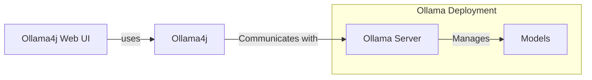

# Ollama4j Web UI

A Web-based UI for [Ollama](https://ollama.com/) written in Java
using [Spring Boot](https://spring.io/projects/spring-boot/) and [Vaadin](https://vaadin.com/) framework.

The goal of the project is to enable Ollama users coming from Java background to have a fully functional web UI.

This project focuses on the raw capabilities of interacting with various models running on Ollama servers.

## Table of Contents

- [How does it work?](#how-does-it-work)
- [Requirements](#requirements)
- [Run the app](#running-the-application)
- [Dev Contributions](#get-involved)

#### How does it work?



#### Requirements


## Running the application

Download the latest version from [here](https://github.com/ollama4j/ollama4j-web-ui/releases).

Or, you could download it via command-line.
Just make sure to specify the version you want to download.

```shell
VERSION=0.0.1; wget https://github.com/ollama4j/ollama4j-web-ui/releases/download/$VERSION/ollama4j-web-ui-$VERSION.jar
```

After downloading the file, run the app.

```shell
java -jar ollama4j-web-ui-$VERSION.jar
```

Then open http://localhost:8080 in your browser.

### Get Involved

Contributions are most welcome! Whether it's reporting a bug, proposing an enhancement, or helping
with code - any sort
of contribution is much appreciated.

### Credits

The nomenclature and the icon have been adopted from the incredible [Ollama](https://ollama.ai/)
project.