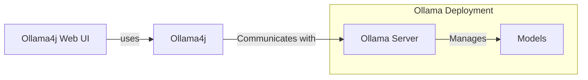

# Ollama4j Web UI

A web UI for [Ollama](https://ollama.com/) written in Java
using [Spring Boot](https://spring.io/projects/spring-boot/) and [Vaadin](https://vaadin.com/) framework
and [Ollama4j](https://github.com/amithkoujalgi/ollama4j).

The goal of the project is to enable Ollama users coming from Java and Spring background to have a fully functional web
UI.

This project focuses on the raw capabilities of interacting with various models running on Ollama servers.

## Table of Contents

- [How does it work?](#how-does-it-work)
- [Requirements](#requirements)
- [Run the app](#running-the-application)
- [Screenshots](#screenshots)
- [Dev Contributions](#get-involved)

#### How does it work?



#### Requirements


## Running the application

### Via Docker

If you already have a Ollama service running, the easiest way to get started is by using Docker by pointing to the host
address of Ollama. Find the image tags [here](https://hub.docker.com/r/amithkoujalgi/ollama4j-web-ui).

Run the Docker container by issuing this in your terminal:

```shell
docker run -it \
  -p 9090:8080 \
  -e OLLAMA_HOST_ADDR='http://192.168.10.1:11434' \
  amithkoujalgi/ollama4j-web-ui
```

### Via Docker Compose

If you want to start the Ollama service and the Ollama Web UI as Docker containers, create a
file called `docker-compose.yaml` and add the following contents in it:

```yaml
services:

  ollama:
    image: ollama/ollama
    ports:
      - "11434:11434"
    volumes:
      - ~/ollama:/root/.ollama
    shm_size: 512mb

  ollama4j-web-ui:
    image: amithkoujalgi/ollama4j-web-ui
    ports:
      - "9090:8080"
    environment:
      OLLAMA_HOST_ADDR: 'http://ollama:11434'
```

Then open up your terminal and then type in:

```shell
docker-compose -f /path/to/your/docker-compose.yaml up
```

And then you access the Ollama4j Web UI on http://localhost:9090.

### As a standalone JAR

Download the latest version from [here](https://github.com/ollama4j/ollama4j-web-ui/releases).

Or, you could download it via command-line.
Just make sure to specify the version you want to download.

```shell
VERSION=0.0.1; wget https://github.com/ollama4j/ollama4j-web-ui/releases/download/$VERSION/ollama4j-web-ui-$VERSION.jar
```

### Configure

Set environment variables.

```shell
export SERVER_PORT=8080
export OLLAMA_HOST_ADDR=http://localhost:11434
```

Or, if you would want to override the base config file, create a file `application.properties` and add the following
configuration.
Update the values of `server.port` and `ollama.url` according to your needs.

```shell
server.port=8080
logging.level.org.atmosphere = warn

spring.mustache.check-template-location = false
spring.servlet.multipart.max-file-size=50MB
spring.servlet.multipart.max-request-size=50MB

vaadin.launch-browser=true
vaadin.whitelisted-packages = com.vaadin,org.vaadin,dev.hilla,io.github.ollama4j

ollama.url=http://localhost:11434
ollama.request-timeout-seconds=120
```

### Run the app

```shell
java -jar ollama4j-web-ui-$VERSION.jar \
  --spring.config.location=/path/to/your/application.properties
```

Then open http://localhost:8080 in your browser to access the Ollama4j Web UI.

### Screenshots


### Improvements

- [ ] Show errors on the UI. For example,
  `io.github.ollama4j.exceptions.OllamaBaseException: model "llama3" not found, try pulling it first`.
- [ ] Settings pane for configuring default params such as `top-p`, `top-k`, etc.

### Get Involved

Contributions are most welcome! Whether it's reporting a bug, proposing an enhancement, or helping
with code - any sort
of contribution is much appreciated.

### Credits

The project is inspired by the awesome [ollama4j-ui](https://github.com/AgentSchmecker/ollama4j-ui) project
by [@AgentSchmecker](https://github.com/AgentSchmecker).

The nomenclature has been adopted from the incredible [Ollama](https://ollama.ai/)
project.
